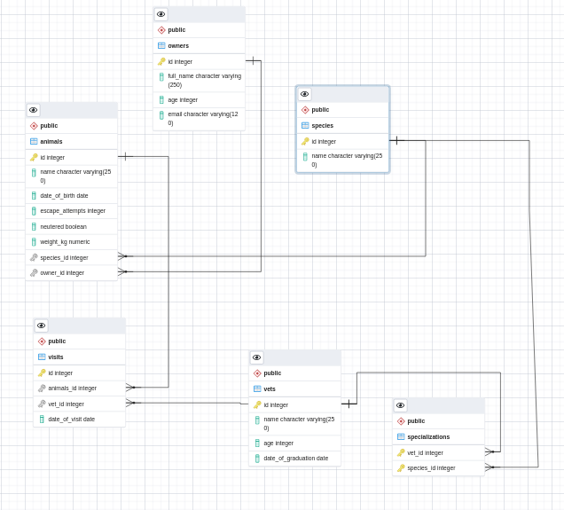

# Vet clinic database

> Relational database to create the data structure for a vet clinic using PostgreSQL.

## Getting Started

This repository includes files with plain SQL that can be used to recreate a database:

- Use [schema.sql](./schema.sql) to create all tables.
- Use [data.sql](./data.sql) to populate tables with sample data.
- Check [queries.sql](./queries.sql) for examples of queries that can be run on a newly created database. **Important note: this file might include queries that make changes in the database (e.g., remove records). Use them responsibly!**

## ER Diagram

## Author

👤 **Fabricio**

| &nbsp;       | &nbsp;                                               |
| ------------ | ---------------------------------------------------- |
| **GitHub**   | [@fabgrel10](https://github.com/fabgrel10)           |
| **Twitter**  | [@fabgrel10](https://twitter.com/fabgrel10)          |
| **LinkedIn** | [@fabgrel10](https://www.linkedin.com/in/fabgrel10/) |

## 🤝 Contributing

Contributions, issues, and feature requests are welcome!

Feel free to check the [issues page](../../issues/).

## Show your support

Give a ⭐️ if you like this project!

## Acknowledgments

- [Postgresql docs](https://www.postgresql.org/docs/)

## 📝 License

This project is [MIT](./MIT.md) licensed.
